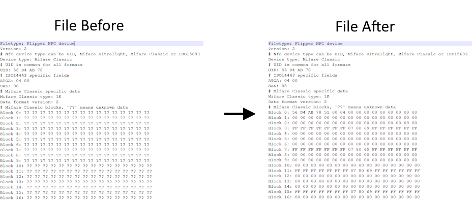

# MIFARE Classic Block Filler

## Overview
The MIFARE Classic Block Filler takes a MIFARE classic file where all of the blocks are unknown, clones it, and fills it with empty data.
- It will fill block 0 with the UID, ATQA, and calculate the BCC value
- It will fill all the data blocks with all zeros
- All keys A and B will be `FF`
- All access conditions will be `FF 07 80 69`

The purpose of this application is to use it in conjuntion with the NFC Magic app. 
If you were to try and write the `Test Card Before.nfc` (in example_files folder) to a Magic Tag,
the UID of the Magic Tag will be `01 02 03 04` because Block 0 is filled with `??`.

After using this application and you write the `Test Card After.nfc` (in example_files folder) to a Magic Tag,
the UID of the Magic Tag will have the correct UID set.

Only really useful if the MIFARE Classic card you want to clone has all of the sectors locked and unable to find the keys for it and you only need the UID.

## Building
1) Clone the [flipperzero-firmware](https://github.com/flipperdevices/flipperzero-firmware) repository or a firmware of your choice
2) Clone this repository and put it in the `applications_user` folder
3) Build this app by using the command `./fbt fap_block_filler`
4) Copy the `.fap` from `build\f7-firmware-D\.extapps\block_filler.fap` to `apps\NFC` using the qFlipper app

## To-Do
- [ ] Add Success View
- [ ] Add Error View
- [ ] Only fill `??` with generic/empty data
- [ ] Add loading thread